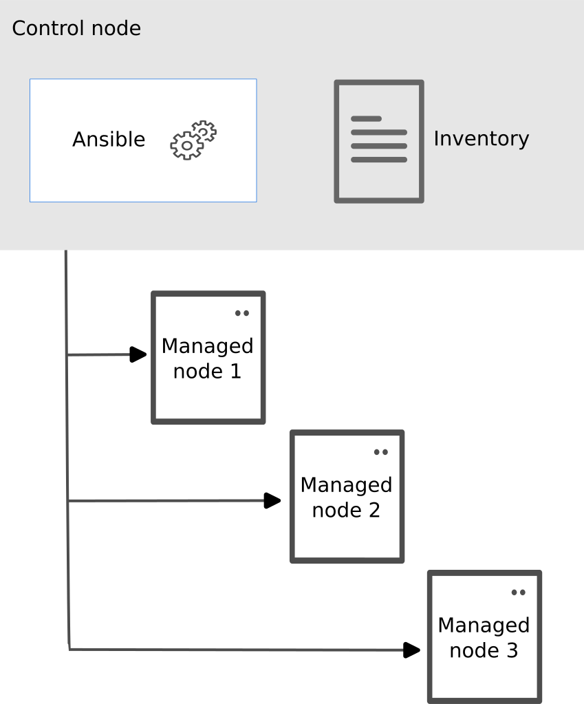

# Overview
Ansible is a powerful automation tool designed to facilitate the management of remote systems while ensuring they adhere to predefined configurations. This explanation is based on the official Ansible documentation available at (the official website)[https://docs.ansible.com/ansible/latest/getting_started/index.html].

A fundamental Ansible environment comprises three core components:

1. Control node: 
   * The Control Node serves as the orchestration center for Ansible operations.
   * It is the primary system where Ansible is installed and executed.
   * The Control Node plays a pivotal role in creating, storing, and running Ansible playbooks.
   * Additionally, it is responsible for configuring and maintaining the Ansible inventory, a crucial element in defining which systems are managed.
2. Managed node: A remote system, or host, that Ansible controls.
3. Inventory: A list of managed nodes that are logically organized. You create an inventory on the control node to describe host deployments to Ansible.

The figure below offers a visual representation of the Ansible system's basic structure:
.