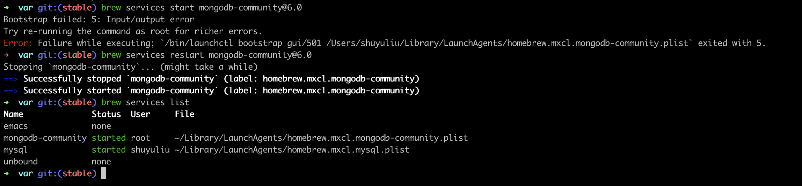

# Overview
Executing the official installation instructions for mongod may pose considerable challenges, often resulting in multiple errors. This guide primarily centers around addressing these encountered errors.

Kindly adhere to the [Official Installation Guide]((https://www.mongodb.com/docs/manual/tutorial/install-mongodb-on-os-x/)) for the installation and initialization of mongod. Employ Homebrew as the installation method on macOS. This installation encompasses the deployment of the ensuing binaries:
1. The `mongod`: server
2. The `mongos`: sharded cluster query router
3. The MongoDB Shell, `mongosh`

# Errors
## Bootstrap failed
```text
Bootstrap failed: 5: Input/output error
Try re-running the command as root for richer errors.
Error: Failure while executing; `/bin/launchctl bootstrap gui/501 /Users/<Your_User_Name>/Library/LaunchAgents/homebrew.mxcl.mongodb-community.plist` exited with 5.
```
Use this command to solve this problem:
```shell
brew services restart mongodb-community@6.0
```
