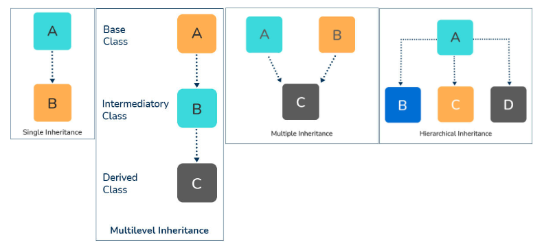

Go to chat gpt, find the "OOP Principles Overview" I have no time to record it here now
- [Overview](#overview)
  - [What is OOP](#what-is-oop)
  - [Why OOP](#why-oop)
  - [Constructor](#constructor)
    - [Constructor types](#constructor-types)
      - [default constructor:](#default-constructor)
      - [Parameterized Constructor](#parameterized-constructor)
      - [Copy Constructor](#copy-constructor)
      - [Constructor Overloading](#constructor-overloading)
  - [Destructor](#destructor)
  - [finalize](#finalize)
  - [Garbage Collection(GC)](#garbage-collectiongc)
  - [Operator Overloading](#operator-overloading)
  - [Limitations of OOP](#limitations-of-oop)
- [Key Principles](#key-principles)
  - [Encapsulation](#encapsulation)
  - [Inheritance](#inheritance)
    - [Single Inheritance](#single-inheritance)
    - [Multiple Inheritance](#multiple-inheritance)
    - [Multi-level inheritance](#multi-level-inheritance)
    - [hierarchical inheritance](#hierarchical-inheritance)
  - [Polymorphism](#polymorphism)
    - [Method Overloading (compile-time polymorphism or static polymorphism)](#method-overloading-compile-time-polymorphism-or-static-polymorphism)
    - [Method Overriding (dynamic polymorphism)](#method-overriding-dynamic-polymorphism)
      - [Virtual functions](#virtual-functions)
  - [Abstraction](#abstraction)
  - [Aggregation](#aggregation)
  - [Composition](#composition)
- [Access Modifier](#access-modifier)
- [Memory Level Perspective](#memory-level-perspective)
  - [Instantiation](#instantiation)
- [Errors \& Exception](#errors--exception)
  - [Exception handling](#exception-handling)
    - [try/catch/finally block](#trycatchfinally-block)
    - [throw/throws](#throwthrows)
- [Comparison](#comparison)
  - [(Java) Interface vs Abstract Class](#java-interface-vs-abstract-class)
    - [Abstract Class](#abstract-class)
    - [Interface](#interface)
  - [data abstraction vs encapsulation](#data-abstraction-vs-encapsulation)
  - [Error vs exception](#error-vs-exception)


# Overview
## What is OOP
OOP is a strategy for representing real-world objects; it consists of variables and methods. Variables are used to record the states of real-world objects, while methods are employed to define the behaviors of these objects.

## Why OOP
1. readable
2. reusable
3. extensible

## Constructor
The constructor will be called automatically to create an instance of a class.

### Constructor types
#### default constructor:
A default constructor is automatically provided by the compiler if no constructor is explicitly defined in the class. It initializes the object's attributes with default values (e.g., numeric types to 0, reference types to `null`).

```java
public class MyClass {
    // Compiler provides a default constructor if none is defined
}
```

#### Parameterized Constructor
take input parameters
```java
public class Car {
    String make;
    String model;
    int year;

    // Parameterized constructor
    public Car(String make, String model, int year) {
        this.make = make;
        this.model = model;
        this.year = year;
    }
}
```

#### Copy Constructor
A copy constructor creates a new object by copying the attributes of an existing object. It is used to create a duplicate (copy) of an object.

```java
public class Point {
    int x;
    int y;

    // Copy constructor
    public Point(Point other) {
        this.x = other.x;
        this.y = other.y;
    }
}

```

#### Constructor Overloading
A class can have multiple constructors with different parameter lists. This is known as constructor overloading.
Similar to the method overloading.

```java
public class Rectangle {
    int length;
    int width;

    // Parameterized constructor
    public Rectangle(int length, int width) {
        this.length = length;
        this.width = width;
    }

    // Constructor overloading with a default constructor
    public Rectangle() {
        this.length = 0;
        this.width = 0;
    }
}
```

## Destructor
A destructor is a method that is called automatically when an object is destroyed. It releases the heap space, closes the files and database connections, etc.

## finalize
Finalize is used to free the unmanaged resources and also help to clean before Garbage Collection(GC). It performs memory management tasks.

## Garbage Collection(GC)
Programming languages like C# and Java include garbage collection (GC) as a memory recovery mechanism. A programming language that supports garbage collection (GC) contains one or more GC engines that automatically release memory space that has been reserved for things the application is no longer using.

## Operator Overloading
Allows developer to define and use operators for user-defined data types in addition to their predefined meanings.

```python
class Point:
    def __init__(self, x, y):
        self.x = x
        self.y = y

    # Overloading the addition operator '+'
    def __add__(self, other):
        return Point(self.x + other.x, self.y + other.y)

    # Overloading the equality operator '=='
    def __eq__(self, other):
        return self.x == other.x and self.y == other.y

    # Overloading the string representation operator '__str__'
    def __str__(self):
        return f"({self.x}, {self.y})"

# Creating instances of the Point class
point1 = Point(1, 2)
point2 = Point(3, 4)

# Using the overloaded addition operator '+'
result = point1 + point2
print("Result of addition:", result)

# Using the overloaded equality operator '=='
are_equal = point1 == point2
print("Are points equal?", are_equal)

# Using the overloaded string representation operator '__str__'
print("String representation of point:", point1)
```

## Limitations of OOP
1. size is large
2. slower execution
3. testing time is higher

# Key Principles
## Encapsulation
Encapsulate data and methods into class to hide it, and use `setter` or `getter` to access variables.
```java
public class Car {
    private String model;
    private int year;

    // Encapsulation - Getter and Setter methods
    public String getModel() {
        return model;
    }

    public void setModel(String model) {
        this.model = model;
    }

    public int getYear() {
        return year;
    }

    public void setYear(int year) {
        this.year = year;
    }
}
```
In this example, the `Car` class encapsulates the data (model and year) using private variables and provides public getter and setter methods to access and modify the data. This way, the internal details of the `Car` class are hidden, and access is controlled.

## Inheritance

### Single Inheritance
Inheritance allows a class (subclass or derived class) to inherit properties and behaviors from another class (superclass or base class).
```java
public class SportsCar extends Car {
    private boolean isConvertible;

    public SportsCar(String model, int year, boolean isConvertible) {
        // Inheritance - Calling superclass constructor
        super.setModel(model);
        super.setYear(year);
        this.isConvertible = isConvertible;
    }

    public boolean getIsConvertible() {
        return isConvertible;
    }
}
```
The `SportsCar` class extends the `Car` class, inheriting its properties and methods. This promotes code reuse, as the `SportsCar` class can use the functionalities of the `Car` class without duplicating code.

### Multiple Inheritance
A class can implement multiple interfaces:

```java
// First interface
public interface Shape {
    // Abstract method
    double calculateArea();
}

// Second interface
public interface Drawable {
    // Abstract method
    void draw();
}

// Class implementing both interfaces
public class Circle implements Shape, Drawable {
    private double radius;

    public Circle(double radius) {
        this.radius = radius;
    }

    // Implementation of calculateArea for Circle (from Shape interface)
    public double calculateArea() {
        return Math.PI * radius * radius;
    }

    // Implementation of draw for Circle (from Drawable interface)
    public void draw() {
        System.out.println("Drawing a circle");
    }
}
```

Now, you can create an instance of the `Circle` class and use it as an object of both the `Shape` and `Drawable` types:

```java
public class Main {
    public static void main(String[] args) {
        Circle circle = new Circle(5.0);

        // Use as a Shape
        double area = circle.calculateArea();
        System.out.println("Area: " + area);

        // Use as a Drawable
        circle.draw();
    }
}

```

### Multi-level inheritance
a class inherits from another class, and then another class inherits from the second class, forming a chain of inheritance. 

```java
// Base class
class Animal {
    void eat() {
        System.out.println("Animal is eating");
    }
}

// Derived class 1
class Mammal extends Animal {
    void breathe() {
        System.out.println("Mammal is breathing");
    }
}

// Derived class 2 (inherits from Mammal)
class Dog extends Mammal {
    void bark() {
        System.out.println("Dog is barking");
    }
}

public class Main {
    public static void main(String[] args) {
        // Create an instance of the Dog class
        Dog myDog = new Dog();

        // Access methods from the base class (Animal)
        myDog.eat();

        // Access methods from the intermediate class (Mammal)
        myDog.breathe();

        // Access methods from the derived class (Dog)
        myDog.bark();
    }
}
```

### hierarchical inheritance
multiple subclasses inherit from a parent class. For example, the fruit class can have ‘apple’, ’mango’, ’banana’, ‘cherry’ etc. as its subclasses.


## Polymorphism
### Method Overloading (compile-time polymorphism or static polymorphism)
Method Overloading allows a class to have multiple methods with the same name but with different parameter lists (different types or different numbers of parameters). The return type is not considered when overloading methods.

```java
public class Calculator {
    // Method with two int parameters
    public int add(int a, int b) {
        return a + b;
    }

    // Method with three int parameters
    public int add(int a, int b, int c) {
        return a + b + c;
    }

    // Method with two double parameters
    public double add(double a, double b) {
        return a + b;
    }
}
```

In this example, the `Calculator` class has multiple `add` methods with the same name but different parameter lists. You can call the appropriate method based on the number and types of arguments you provide.
```java
public class Main {
    public static void main(String[] args) {
        Calculator calculator = new Calculator();

        System.out.println(calculator.add(1, 2));           // Calls the first add method
        System.out.println(calculator.add(1, 2, 3));        // Calls the second add method
        System.out.println(calculator.add(1.5, 2.5));       // Calls the third add method
    }
}
```
The compiler determines which method to call based on the method signature at compile time.


### Method Overriding (dynamic polymorphism)
allows a subclass or child class to provide a specific implementation of a method which is already provided by one of its superclasses or parent classes.

Dynamic polymorphism is a method or process that handles a call to an overridden method during runtime rather than at compile time.

#### Virtual functions
Virtual functions are also part of the functions which are present in the parent class and they are overridden by the subclass. These functions help to achieve runtime polymorphism.

## Abstraction
```java
public abstract class Shape {
    // Abstraction - Abstract method
    public abstract double calculateArea();
}

public class Circle extends Shape {
    private double radius;

    public Circle(double radius) {
        this.radius = radius;
    }

    // Implementation of calculateArea for Circle
    public double calculateArea() {
        return Math.PI * radius * radius;
    }
}
```
In this example, the `Shape` class is an abstract class with an abstract method `calculateArea()`. The `Circle` class extends `Shape` and provides a concrete implementation of the `calculateArea` method. The abstraction allows you to define a common interface (or contract) for different shapes without worrying about specific details until you create a concrete class.

## Aggregation
A specific form of association where one object is part of another object. Aggregation represents a "has-a" relationship, where one object contains another object, but the contained object can exist independently.
```java
import java.util.List;
import java.util.ArrayList;

class Employee {
    private String name;

    public Employee(String name) {
        this.name = name;
    }

    public String getName() {
        return name;
    }
}

class Department {
    private String name;
    private List<Employee> employees;

    public Department(String name) {
        this.name = name;
        this.employees = new ArrayList<>();
    }

    public void addEmployee(Employee employee) {
        employees.add(employee);
    }

    public List<Employee> getEmployees() {
        return employees;
    }
}

public class AggregationExample {
    public static void main(String[] args) {
        Employee employee1 = new Employee("John Doe");
        Employee employee2 = new Employee("Jane Smith");

        Department department = new Department("Engineering");
        department.addEmployee(employee1);
        department.addEmployee(employee2);

        // Department has employees, but employees can exist independently
        System.out.println("Department: " + department.getEmployees());
    }
}
```

In this example, a `Department` "has" a list of `Employee` objects. The aggregation relationship allows employees to exist independently, and they can be associated with multiple departments if needed.

## Composition
A stronger form of aggregation where one object is composed of other objects, and the composed objects have a strong ownership relationship. The composed objects cannot exist independently.

```java
class Department {
    private String name;
    private List<Employee> employees;

    public Department(String name) {
        this.name = name;
        this.employees = new ArrayList<>();
    }

    // Now, Department composes Employee objects directly
    public void addEmployee(String employeeName) {
        Employee employee = new Employee(employeeName);
        employees.add(employee);
    }

    public List<Employee> getEmployees() {
        return employees;
    }
}

public class CompositionExample {
    public static void main(String[] args) {
        Department department = new Department("Engineering");

        // Employees are composed directly within the Department
        department.addEmployee("John Doe");
        department.addEmployee("Jane Smith");

        // Employees cannot exist independently without the Department
        System.out.println("Department: " + department.getEmployees());
    }
}
```
In this composition example, the `Department` class composes `Employee` objects directly. Employees cannot exist independently outside the context of a department. If the department is removed, the employees associated with it are also removed. This illustrates a "whole-part" relationship.

# Access Modifier
1. private
2. protected
3. public
4. final: 
   1. When applied to a variable, the final modifier indicates that the variable's value cannot be modified after it has been initialized.
   2. When applied to a method, the final modifier indicates that the method cannot be overridden by subclasses. This is often used when a method's implementation should remain constant across all subclasses.
   3. When applied to a class, the final modifier indicates that the class cannot be extended, i.e., no other class can inherit from it.

**Python**: has no strict enforcement of access modifiers. There are some name conventions like `_protected_method`, `__private_method`, etc. These conventions are not enforced by the Python interpreter. They are recommendations for developers to follow for better code organization and understanding.

# Memory Level Perspective
## Instantiation
When you create an instance of a class in Java, memory is allocated to store the object's instance variables and a reference to the class's methods (static methods excluded). When a method is called on an object, the JVM uses the reference to the method area to locate and execute the appropriate method code.
The methods of a class are part of the class definition, and they are not duplicated for each object instance. Instead, a single copy of the method code exists in the class's method area in the JVM (Java Virtual Machine). When an object is created, it does not store a copy of the methods. Instead, it contains a reference (memory address) to the class's method area where the code for the methods is stored. This reference is commonly referred to as the "vtable" (virtual method table) or "dispatch table".

**static methods**: static methods can be called without creating an instance of the class. They are called using the class name: `MyClass.staticMethod();`. When a class is loaded by the JVM, static methods loaded the same as other methods. However, static methods are associated with the class, instead of an instance, so when create a new instance, no memory allocated to static methods.

Static methods are typically used for operations that are related to the class as a whole and do not depend on the state of a specific instance.

For example:
```java
public class MathOperations {
    // Static method to calculate the square of a number
    public static double calculateSquare(double number) {
        return number * number;
    }
}
```

`calculateSquare` method performs mathematical operations (squaring and cubing) and are not dependent on the state of any specific instance of the class.

# Errors & Exception
## Exception handling
It is used to manage errors. An exception handler help to throw errors and then catch the error in order to solve them.

### try/catch/finally block
The terms “try” and “catch” describe how to handle exceptions brought on by coding or data mistakes while a program is running. The section of code where exceptions occur is called a try block. Exceptions from try blocks are caught and handled in a catch block.
Regardless of whether an exception is thrown or caught, the finally block is always executed.

### throw/throws
In JS, Java and python, use `throw` to raise or throw an exception. The thrown exception can be caught by `catch` block
```java
public class Example {
  // Method declaration with 'throws' clause
  public void myMethod() throws SomeException {
    // Method body with 'throw' keyword
    if (someCondition) {
      throw new SomeException("An error occurred");
    }
    // Method logic
  }
}
```
# Comparison
## (Java) Interface vs Abstract Class
### Abstract Class
1. Constructor: Can have constructors (including parameterized constructors, which can take input parameters).
2. Fields: Can have instance variables (fields).
3. Methods: Can have abstract methods (methods without a body) as well as concrete methods (methods with a body).
4. Access Modifiers: Can have different access modifiers for methods and fields.
5. Inheritance: Supports single inheritance (a class can extend only one abstract class).
6. Instantiation: no instantiation.

```java
public abstract class Shape {
    private String color;

    public Shape(String color) {
        this.color = color;
    }

    // Abstract method
    public abstract double calculateArea();

    // Concrete method
    public void displayColor() {
        System.out.println("Color: " + color);
    }
}
```

### Interface
1. Constructor: no constructors.
2. Fields: only constant variables (public, static, final).
3. Methods: Can only have abstract methods (methods without a body)
   1. Java 8 allows to have default/static methods (with a body).
4. Access Modifiers: All methods in an interface are public by default.
5. Inheritance: Supports multiple inheritance (a class can implement multiple interfaces). ??

```java
public interface Shape {
    // Constant variable
    String DEFAULT_COLOR = "Red";

    // Abstract method
    double calculateArea();

    // Default method (Java 8 onward)
    default void displayColor() {
        System.out.println("Color: " + DEFAULT_COLOR);
    }
}
```


## data abstraction vs encapsulation
Abstraction solves the problem at the design level and encapsulation solves the problem at the implementation level.

## Error vs exception
error: application shouldn't encounter
exception: application try to catch