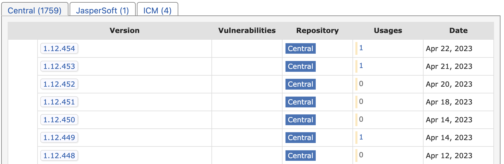
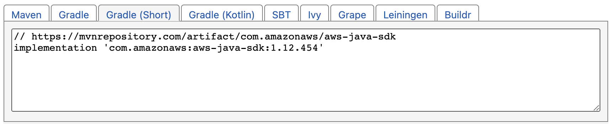

# Overview

# Add a dependency
In order to add a dependency, we use [mvnrepository](https://mvnrepository.com/) to search for necessary package.
1. Go to [mvnrepository](https://mvnrepository.com/).
2. Check and select the dependency you want.
3. Click the version on 
4. Go to  and select the right Java build automation tool.
5. Copy and paste the link to the `build.gradle`
6. This icon appears if you are using the `IntelliJ`. Click it to build.

# Dependency List
1. `org.springframework.boot:spring-boot-starter-web`: for `MultipartFile`, which could 