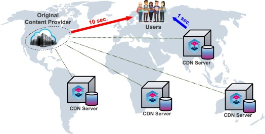

# Overview
CDS stands for Content Delivery Server, which is a type of server or infrastructure designed to efficiently deliver static content, such as web pages, images, videos, and other multimedia, to end-users in CDN.
Here's an example to illustrate how a CDS works:

Imagine you have a website with users located in different parts of the world. Without a Content Delivery Server, when a user requests a web page or any other content from your website, the request would typically go to your **origin server**, which may be located in a specific geographic location.

However, with a CDS in place, the content is distributed across multiple servers strategically located in different regions or data centers. These servers are often referred to as **edge servers** or points of presence (PoPs). When a user requests content, the CDS automatically determines the server closest to the user's geographic location and serves the content from that edge server.

# Details in an example
Let's use the Amazon online shopping platform as an example to illustrate how Content Delivery Servers (CDS) work.

1. Static content:
   Amazon employs a global network of edge servers, acting as CDS, distributed across different geographical locations. When a user visits the website, the CDN automatically determines the closest edge server based on the user's geographic location. This edge server serves the static content, including static web pages, product images, CSS stylesheets, and JavaScript files, to the user.
   **Same content** When two users share the same CDS for a website like Amazon, they would initially see the same version of a page because the CDS is not user-sensitive. However, it's important to note that the dynamic content on the page, such as personalized product recommendations, user-specific data, and dynamic pricing information, is not handled by the CDS.
   **Cache**  The CDS has an inherent caching capability. Upon the first request for a specific static asset, if it is not present in the CDS cache, the request is forwarded to the origin server. Simultaneously, the CDS caches a copy of the content item on the edge server that received the request. Subsequent requests for the same content can be served directly from the cache on the CDS edge server, avoiding the need to access the origin server again. However, it is important to note that the CDS does not cache static assets at each request; caching occurs as assets are requested and cached on-demand.
2. Load Balancing
   CDNs often employ load balancing techniques to distribute incoming requests across multiple edge servers. If the closest CDS is experiencing a high volume of requests or nearing capacity, load balancing helps redistribute the requests to other available servers within the CDN's network. This ensures optimal resource utilization and scalability of the content delivery infrastructure.
3. Dynamic Content
   Dynamic content, such as personalized product recommendations, pricing information, user-specific data, and inventory details, requires application logic. Therefore, user requests for dynamic content are forwarded to the origin server, which processes the requests and generates the appropriate dynamic responses.
4. Combine dynamic and static content
   Once the origin servers generate the dynamic content or complete a transaction, the response is sent back to the CDN edge server that initially received the request. The edge server then delivers the response, containing the combined dynamic and static content, to the user's device.

# chat gpt

Q: What is CDS - Content Delivery Server
A: CDS stands for Content Delivery Server, which is a type of server or infrastructure designed to efficiently deliver content, such as web pages, images, videos, and other multimedia, to end-users. The primary goal of a Content Delivery Server is to improve the performance, reliability, and scalability of content delivery by reducing latency and increasing data transfer speeds.

Here's an example to illustrate how a CDS works:

Imagine you have a website with users located in different parts of the world. Without a Content Delivery Server, when a user requests a web page or any other content from your website, the request would typically go to your origin server, which may be located in a specific geographic location.

However, with a CDS in place, the content is distributed across multiple servers strategically located in different regions or data centers. These servers are often referred to as edge servers or points of presence (PoPs). When a user requests content, the CDS automatically determines the server closest to the user's geographic location and serves the content from that edge server.

The benefits of using a CDS include:

1. Improved performance: By serving content from servers closer to end-users, the latency is reduced, resulting in faster loading times for web pages, videos, and other content.
2. Scalability: CDS solutions can handle high traffic volumes and sudden spikes in demand by distributing the load across multiple edge servers.
3. Load balancing: CDS systems use intelligent algorithms to distribute incoming requests across multiple servers, optimizing the overall load and preventing any single server from becoming overwhelmed.
4. Caching: CDS can cache frequently accessed content on edge servers, reducing the load on the origin server and improving response times for subsequent requests for the same content.

Popular CDS providers include Cloudflare, Akamai, Amazon CloudFront, and Fastly. These providers offer a global network of edge servers and provide APIs and tools to manage content delivery efficiently.

It's worth noting that CDS is just one component of a larger content delivery architecture. Other components may include origin servers, load balancers, and CDN (Content Delivery Network) management tools.

Q: so, tell me more about CDN?

A: Certainly! CDN stands for Content Delivery Network. A CDN is a distributed network of servers strategically placed in various locations worldwide. Its primary purpose is to deliver web content, such as HTML pages, images, videos, and other media, to end-users with high performance and reliability.

Here are some key aspects and benefits of CDN:

1. Content Distribution: When a user requests content from a website or an application, the CDN routes the request to the closest edge server within its network. This reduces the distance between the user and the server, minimizing latency and improving the overall delivery speed.

2. Caching: CDNs employ caching mechanisms to store frequently accessed content on their edge servers. When a user requests a piece of content that is already cached on an edge server, the CDN can deliver it directly from the edge server, eliminating the need to fetch it from the origin server. Caching helps reduce the load on the origin server and improves response times for subsequent requests.

3. Load Balancing: CDNs often incorporate load balancing algorithms to distribute incoming traffic across multiple servers, optimizing resource utilization and preventing any single server from becoming overwhelmed. Load balancing helps ensure high availability and scalability of the content delivery infrastructure.

4. Scalability and Global Reach: CDNs have a global network of edge servers distributed across various geographical locations. This distributed architecture enables them to scale and handle high volumes of traffic efficiently. Additionally, it allows content to be delivered from servers closer to end-users worldwide, reducing latency and improving the user experience.

5. DDoS Mitigation: CDNs often offer built-in DDoS (Distributed Denial of Service) mitigation capabilities. They can absorb and mitigate large-scale DDoS attacks by leveraging their distributed infrastructure and implementing security measures to filter out malicious traffic.

6. Analytics and Reporting: CDNs provide analytics and reporting tools that offer insights into content delivery performance, user behavior, and traffic patterns. This data can help website owners and administrators optimize their content delivery strategy, identify performance bottlenecks, and make informed decisions.

Popular CDN providers include Cloudflare, Akamai, Fastly, Amazon CloudFront, and Google Cloud CDN. These providers offer a range of services and features, including caching, load balancing, security, and analytics, to enhance content delivery and improve the overall user experience.

CDNs are widely used by organizations of all sizes, from small websites to large-scale applications, to optimize content delivery, reduce latency, and ensure a fast and reliable user experience, regardless of the user's location.

Q: What I heard is the the CDS doesn't run any application logic, so for example, I have a spring boot project running in Area A, which is my origin server. However, when a client send a request, the closest CDS locates in Area B, but because CDS doesn't run application logic, how can the CDS in Area B understand my request?

A: You're correct that Content Delivery Servers (CDS) typically do not run application logic. Their main purpose is to efficiently deliver static content, such as HTML files, images, CSS, and JavaScript, to end-users. However, when it comes to dynamic content that requires application logic, the request needs to be forwarded from the CDS to the origin server where the application is hosted.

Let's consider your example:

1. Client Request: A client sends a request to the CDS located in Area B. The request contains information such as the URL, headers, and possibly some parameters.

2. CDS Edge Server: The CDS edge server in Area B receives the client request. Since the CDS edge server is strategically located closer to the client, it can provide faster delivery of static content.

3. Routing to Origin Server: For dynamic content, the CDS needs to forward the request to the origin server (your Spring Boot project) located in Area A. The CDS uses various mechanisms to route the request back to the origin server. This can be done using HTTP protocols, reverse proxy configurations, or through load balancers.

4. Origin Server Processing: The origin server in Area A receives the forwarded request from the CDS. At this point, the application logic in your Spring Boot project processes the request, performs any necessary computations, database operations, or other dynamic operations, and generates a response.

5. Response Delivery: Once the origin server generates the response, it sends it back to the CDS edge server that initially received the request in Area B.

6. CDS Response to Client: Finally, the CDS edge server in Area B delivers the response to the client that originally made the request.

In summary, while the CDS does not run the application logic itself, it acts as an intermediary between the client and the origin server. It handles the delivery of static content, caching, load balancing, and routing requests to the appropriate origin server for dynamic content processing. By leveraging the global network of edge servers, the CDS helps optimize content delivery, reduce latency, and improve the overall user experience.

Q: You mentioned dynamic content and static content, it reminders me of the server rendering and client rendering, so can I say that the static content is the server rendering content and dynamic content is a client rendering content? the CDS server will store the server rendering content and origin server will holding the client rendering content?

A: The distinction between static content and dynamic content is not necessarily tied to server rendering and client rendering specifically, although there can be some overlap.

Static content refers to files that remain unchanged for a period of time, such as HTML files, CSS stylesheets, JavaScript files, images, and other assets. These files are typically generated during the development process or when content is updated, but they do not change frequently in response to user interactions or requests.

Dynamic content, on the other hand, is generated dynamically in response to user requests or interactions. It often involves processing data, making database queries, applying business logic, and generating a customized response based on the specific user's context or input.

Now, regarding server rendering and client rendering:

- Server Rendering: In server rendering, the web server generates the complete HTML markup on the server side and sends it as a response to the client. This means that the server is responsible for rendering the initial content and delivering it to the client's browser. Server rendering is typically used in traditional server-rendered web applications, where the server processes requests, executes application logic, and generates the HTML that represents the initial page.

- Client Rendering: In client rendering, the server delivers a minimal HTML page to the client, often referred to as a "shell" or "skeleton." The majority of the content and interactivity is then generated on the client-side using JavaScript frameworks or libraries. The client-side JavaScript code fetches data from APIs, manipulates the DOM, and dynamically updates the content without requiring full page reloads. Single-page applications (SPAs) and progressive web applications (PWAs) commonly utilize client rendering approaches.

It's worth noting that both server rendering and client rendering can involve dynamic content. In server rendering, the server dynamically generates the initial HTML content based on the request. In client rendering, the client-side JavaScript code dynamically fetches and renders content based on user interactions or data updates.

When it comes to content delivery, a CDS can handle both static and dynamic content. The CDS typically caches and delivers static content efficiently, reducing the load on the origin server and improving delivery performance. Dynamic content, which often involves personalized or real-time data, is typically not cached at the edge servers of the CDS but is instead routed to the origin server for processing on a per-request basis.

So, to summarize, the classification of static content and dynamic content is not inherently tied to server rendering and client rendering. Both server rendering and client rendering can involve dynamic content. The CDS primarily focuses on optimizing the delivery of static content, while dynamic content may require processing on the origin server to generate a customized response for each request.

Q: So let's say I have a spring boot project, where client can view some images uploaded by other clients, but according to the filter they set they can see different images. Does these image locate in the CDS or origin server?

A: In the scenario you described, where clients can view images based on their set filters, the images would typically be stored on the origin server rather than the Content Delivery Server (CDS).

The origin server, which is your Spring Boot project, serves as the primary source of data and content for your application. It is responsible for storing and managing the images and handling the logic for filtering and serving the appropriate images to clients based on their filter settings.

When a client requests to view images based on their filters, the following process typically takes place:

1. Client Request: The client sends a request to the server, specifying their filter settings (e.g., filter parameters in the URL or request body).

2. Origin Server Processing: The Spring Boot project on the origin server receives the request and processes it. It applies the filter logic based on the client's settings to determine which images should be included in the response.

3. Image Retrieval: The origin server retrieves the relevant images from its storage (e.g., a file system, database, or cloud storage) based on the filtered criteria.

4. Response Generation: The server generates a response containing the filtered images and sends it back to the client.

5. Client Display: The client's browser or application receives the response and renders the images for the user to view.

In this flow, the CDS typically does not store the actual images. Instead, the CDS may be responsible for caching static assets such as CSS, JavaScript files, or other non-personalized content that doesn't change frequently. The CDS can help improve the delivery speed and performance of these static assets by serving them from edge servers closer to the client.

Dynamic content, like the filtered images in your case, is usually generated and served from the origin server on a per-request basis, as it requires the application logic to apply the filters and retrieve the appropriate images.

Therefore, while the CDS plays a role in content delivery, it's the origin server that stores and serves the images based on the filter criteria set by the clients.

Q: but what the CDS do in the scenario?

A: In the scenario you described, where clients can view images based on their set filters, the Content Delivery Server (CDS) can still play a role in optimizing content delivery and enhancing performance, even though the images themselves are stored on the origin server.

Here's how the CDS can be involved:

1. Caching: The CDS can cache the static assets associated with your application, such as HTML files, CSS stylesheets, JavaScript files, and any other non-personalized content that doesn't change frequently. This caching mechanism allows the CDS to store copies of these assets on its edge servers, closer to the clients. When subsequent requests for the same assets are made, the CDS can deliver them directly from its cache, reducing the load on the origin server and improving response times.

2. Edge Server Distribution: The CDS operates a network of edge servers located in various geographic regions. These edge servers help reduce the network latency and improve the delivery speed for clients by serving content from a location closer to them. So, even though the images are stored on the origin server, the CDS can ensure that the clients receive the content from the nearest edge server, resulting in faster content delivery.

3. Load Balancing: The CDS can implement load balancing mechanisms to distribute incoming requests across multiple edge servers or even multiple instances of the origin server. This helps optimize resource utilization and ensures that no single server becomes overwhelmed by handling all the requests. Load balancing can be particularly useful when the number of clients and the request load are high.

4. DDoS Protection: The CDS may provide DDoS mitigation capabilities to protect the origin server from large-scale Distributed Denial of Service attacks. By leveraging its distributed infrastructure and traffic filtering mechanisms, the CDS can identify and block malicious traffic, ensuring that legitimate requests reach the origin server without disruption.

While the CDS primarily focuses on caching and optimizing the delivery of static assets, it can enhance the overall performance, availability, and security of your application. By offloading static asset delivery and handling global content distribution efficiently, the CDS allows the origin server to focus on generating dynamic content, such as processing the filter settings and retrieving the appropriate images for each client's request.

So, even though the images themselves reside on the origin server, the CDS plays a crucial role in caching, load balancing, edge server distribution, and DDoS protection to optimize content delivery and improve the overall user experience.

Q: so, can you use the Amazon online shopping as a example to show me how the CDS works?

A: Certainly! Let's use Amazon, the popular online shopping platform, as an example to illustrate how a Content Delivery Server (CDS) can work in the context of an e-commerce application.

1. User Browsing Amazon:
   When a user visits the Amazon website or mobile app, they interact with the user interface, search for products, and browse various pages.

2. Content Distribution:
   Amazon utilizes a CDN/CDS to efficiently deliver static content to the user's device. This content includes static web pages, product images, CSS stylesheets, JavaScript files, and other assets required for rendering the website. The CDN, like Amazon CloudFront, has a global network of edge servers distributed in various locations.

3. Edge Server Selection:
   When a user requests a web page, the CDN automatically determines the edge server closest to the user's geographic location. This edge server is responsible for serving the static content to the user.

4. Caching Static Content:
   The CDN caches static content on its edge servers. As users access popular pages or product images, the CDN stores copies of these assets in its cache. Subsequent requests for the same content can be served directly from the edge server's cache, reducing the load on Amazon's origin servers and improving response times.

5. Load Balancing and Scalability:
   The CDN employs load balancing techniques to distribute incoming user requests across multiple edge servers. This ensures efficient resource utilization and enables scalability, allowing Amazon to handle high traffic volumes during peak periods.

6. Dynamic Content and Origin Server:
   While the CDN handles static content, dynamic content such as personalized product recommendations, pricing information, user-specific data, and inventory details require application logic. The user's requests for dynamic content are forwarded from the edge server to Amazon's origin servers, which are responsible for processing the requests, retrieving data from databases, and generating dynamic responses.

7. Transaction Processing and Database:
   When a user adds items to their cart, proceeds to checkout, or performs any transaction-related activity, the request is processed by Amazon's origin servers. These servers interact with the backend systems, such as inventory management and payment processing, to complete the transaction. The origin servers also store and retrieve data from databases that contain product information, user profiles, and order history.

8. Response Delivery:
   Once the origin servers generate the dynamic content or complete a transaction, the response is sent back to the CDN edge server that initially received the request. The edge server then delivers the response to the user's device, ensuring a fast and responsive shopping experience.

Throughout this process, the CDN/CDS optimizes content delivery, improves performance, and enhances scalability for Amazon's online shopping platform. By caching static content, distributing it across edge servers, and load balancing user requests, the CDN helps minimize latency, reduce server load, and provide a seamless shopping experience for users worldwide.

Q: Can I say that for two users sharing the same CDS should initially see the same page on Amazon online shopping page, because the CDS is not user-sensitive?

A: Yes, that's correct. In a typical setup, when two users share the same Content Delivery Server (CDS) for a website like Amazon, they would initially see the same version of a page because the CDS is not user-sensitive.

The purpose of a CDS is to efficiently deliver static content, such as web pages, images, CSS stylesheets, and JavaScript files, to users. These static assets are usually the same for all users accessing a particular page on the website. Therefore, when multiple users access the same page through the same CDS, they would receive identical static content from the cache of the edge server handling their requests.

However, it's important to note that the dynamic content on the page, such as personalized product recommendations, user-specific data, and dynamic pricing information, is not handled by the CDS. This type of content requires user-specific information and dynamic processing, which is typically handled by the origin server based on the user's session, preferences, or other factors.

So, while the initial version of the page served by the CDS may appear the same for multiple users, as they interact with the website, perform searches, or log in to their accounts, the dynamic content and personalized experiences will differ based on their individual interactions and user-specific data managed by the origin server.