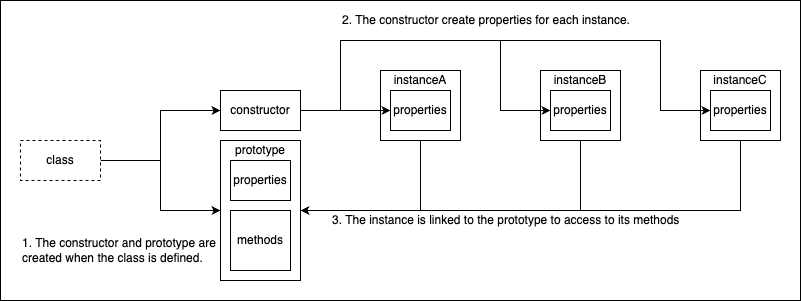

# Overview

# Memory 
When a class is defined in TypeScript, it generates a constructor function and a prototype object that contains properties and methods. When an instance of the class is created using the `new` keyword, the constructor function initializes the instance's properties and links the instance to the prototype object to allow access to the methods defined on the prototype object. Therefore, **all instances of the class share the same methods** defined on the prototype object, and **TypeScript does not allocate additional memory for these methods**. The memory usage of the instance is determined by its properties and any additional memory allocated for the instance itself, such as closures or event listeners.  
