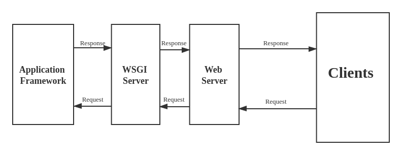

# overview
Flask is a lightweight Python web framework for building web applications quickly, basing on **WSGI** and **Jinjia2** engine, following the **Model-View-Template** (MVC) pattern (or more accurately, the Model-View-Template pattern).

Features:
1. Built-in web server and debugger
2. Compatibility with most of the latest technologies.
3. High scalability and flexibility for simple web applications.
4. Integrated support for unit testing
5. Securing cookies in client-side sessions
6. Dispatching RESTful request
7. Google App Engine compatibility
8. Unicode support
9. Web Server Gateway Interface(WSGI) compliance

# WSGI
The "Web Server Gateway Interface" (WSGI) is a specification for a standardized interface between web servers and Python web applications or frameworks.



## The responsibilities of WSGI

1. Routing Server's Request: WSGI receives HTTP requests from the web server and is responsible for routing these requests to the appropriate Python web application or framework based on factors such as the HTTP method, headers, and requested URL.
2. Formatting the Response: After the Python web application processes the request and generates a response, WSGI ensures that the response is formatted correctly. This involves packaging the response data, including the status code, headers, and body, in a standardized way that can be understood by the web server.

## Characteristics

**Flexibility**: WSGI allows developers to build web applications without being tied to a specific web server or framework. As long as both the web server and the application support WSGI, they can work together seamlessly.

**Middleware**: WSGI supports the use of middleware components, which are intermediary components that can modify requests and responses. Middleware provides a way to extend and customize the behavior of a web application.


# MVT (Model-View-Template)

## Model
Models often interact with databases to store and retrieve data, and Flask supports various database integration options.

```python
from flask_sqlalchemy import SQLAlchemy

app = Flask(__name__)
app.config['SQLALCHEMY_DATABASE_URI'] = 'sqlite:///site.db'
db = SQLAlchemy(app)

class User(db.Model):
    id = db.Column(db.Integer, primary_key=True)
    username = db.Column(db.String(80), unique=True, nullable=False)
    email = db.Column(db.String(120), unique=True, nullable=False)

@app.route('/users')
def list_users():
    users = User.query.all()
    return render_template('user_list.html', users=users)
```

## View
In Flask, the route configuration is responsible for mapping a specific URL pattern to a particular view function. These functions handle HTTP requests and define what content should be displayed or returned.


## Template
Templates are HTML files that include both static content and placeholders (or variables) for dynamic data.

Templates in Flask are usually written using the Jinja2 template engine. Templates define the structure of HTML pages and allow the embedding of dynamic content using placeholders and control structures.

### Template Engine
A template engine is a software module or component, the template engine processes the template, replacing the placeholders with actual data, resulting in a final rendered output.

### Template Inheritance
We’ve noticed that a website’s web pages all have the same footer, navigation bar, and other elements. Instead of creating the identical footer and navigation bar on each webpage separately, we utilize template inheritance, which allows us to generate the part that is common to all webpages (e.g. footer, navigation bar) only once and eliminates the need to write the HTML, head, and title tag many times.

## Route
In Flask, the route configuration is responsible for mapping a specific URL pattern to a particular view function.

### dynamic route
In Flask, the `url_for` function is used to dynamically generate URLs for a given endpoint (view function) by providing its name. Here's an example of how to implement dynamic routes using `url_for`:

```python
from flask import Flask, render_template, url_for

app = Flask(__name__)

# Sample data
posts = [
    {'id': 1, 'title': 'Post 1', 'content': 'This is the content of post 1.'},
    {'id': 2, 'title': 'Post 2', 'content': 'This is the content of post 2.'},
    {'id': 3, 'title': 'Post 3', 'content': 'This is the content of post 3.'},
]

@app.route('/')
def home():
    return render_template('home.html', posts=posts)

@app.route('/post/<int:post_id>')
def post_detail(post_id):
    # Assuming post_id is an integer
    post = next((p for p in posts if p['id'] == post_id), None)
    if post:
        return render_template('post_detail.html', post=post)
    else:
        return 'Post not found', 404

# Example of generating URLs dynamically using url_for
with app.test_request_context():
    url_home = url_for('home')
    url_post_detail = url_for('post_detail', post_id=1)

if __name__ == '__main__':
    app.run(debug=True)
```

**identifier**: `/post/<int:post_id>` defines a route with an identifier (`<post_id>`). This means that this route expects a dynamic value for the `post_id` parameter in the URL. The `post_detail` function is associated with this route and it takes `post_id` as a parameter.


# difference
## difference between Django vs Flask


# SQLAlchemy
SQLAlchemy is an open-source SQL toolkit and Object-Relational Mapping (ORM) library for Python. It provides a set of high-level API (Application Programming Interface) for interacting with relational databases, allowing developers to work with databases in a more Pythonic way.

# host and port
127.0.0.1:5000

# `Flask(__name__)`
The `__name__` parameter is a Python built-in variable that is set to the name of the current module. When we pass `__name__` as an argument to the Flask class constructor, it helps Flask to determine where to locate resources such as templates and static files.

# cookie and session
1. In your view function, when you modify the `session` object by setting key-value pairs, like `session['user_id'] = user_id`, Flask automatically keeps track of these changes.
2. After your view function finishes processing and before sending the response back to the client, Flask automatically updates the session cookie.
3. The session cookie includes the session ID and any modifications made to the `session` object during the request.
4. The updated session cookie is sent back to the client with the response.
5. In subsequent requests, when the client sends the session cookie back to the server, Flask uses the session ID from the cookie to retrieve the corresponding session data.
6. The `session` object in your Flask application code is then populated with the stored session data.

# database
## one-request database connections in Flask
In Flask, a "one-request database connection" typically refers to the practice of establishing a new database connection for each incoming HTTP request and closing that connection after the request is processed.

## `before_request()`
The `before_request()` function is executed before each request is handled by a view function.
```python
from flask import g

@app.before_request
def load_user():
    user = User.query.get(request.session.get("user_id"))
    g.user = user

@app.route("/admin")
def admin():
    if g.user is None or not g.user.is_admin:
        return redirect(url_for("index"))
```

# `g` object
`g` object is designed to store data that needs to be shared between different parts of your application during the processing of a single request, which is not shared between different requests.

# context
## context local
In Flask, the term "context locals" refers to a mechanism used to store and access data that is specific to the current context but is isolated from other threads or contexts.

For example, request context and application context.

### request context
The request context keeps track of the request-level data during a request. It's mainly used for reading and processing data related to the incoming request. Flask automatically pushes a request context when handling a request. View functions, error handlers, and other functions that run during a request will have access to the request proxy, which points to the request object for the current request.

### application context
The application context keeps track of the application-level data during a request, CLI command, or other activity.

### life cycle
The application context is created and destroyed as necessary. When a Flask application begins handling a request, it pushes an application context and a request context. When the request ends it pops the request context then the application context. Typically, an application context will have the same lifetime as a request.


# concurrency
a common model for many applications:

- One Process: The web application runs within a single process. This process is responsible for managing the application code, resources, and global state.
- Multiple Threads: Within that single process, multiple threads are used to handle concurrent requests. Each thread is dedicated to processing an individual request. Threads within the same process share the same memory space, allowing them to access shared resources and data.

## process
- A process is an independent program in execution. It consists of one or more threads, as well as the associated resources (memory, file descriptors, etc.) needed to execute the program.
- Each process has its own memory space, including code, data, and file descriptors. Processes do not share memory by default.
- Processes are isolated from each other, Communication between processes typically requires inter-process communication (IPC) mechanisms, such as pipes, sockets, or message passing.

## thread
- When a request is received by the server, the server creates a new thread to handle that specific request.
- Each thread operates independently and is isolated from other threads. This isolation is crucial to avoid conflicts and unintended sharing of data between threads.
- Thread-local storage mechanisms, such as Flask's Local object, ensure that certain data is associated with and isolated to the specific thread handling a particular request. For example, the `g` object in Flask is often used with thread-local storage to share data within the context of a single request but isolate it from other requests being handled concurrently in different threads.
- Multiple threads can execute in parallel, allowing the server to handle multiple requests concurrently. This concurrency is achieved without the need to launch a separate process for each request.

# memory managed in Flask python
In a flask, Memory allocation is managed by the Flask Python memory management. Also, It has an inbuilt garbage collector which recycles all unused memory to save up heap space.

# What type of Applications can we create with Flask
Flask, for example, can be used in concert with NodeJS serverless, AWS lambda, and other third-party services to create cutting-edge systems. We can also build Single Page Apps, RESTful API-based Apps, SAS Apps, Small to Medium Websites, Static Websites, Machine Learning Applications, Microservices, and Serverless Apps.

# RESTful APIs
When building RESTful APIs in Flask, you typically don't use traditional templates as you would in a web application with server-rendered views. Instead, you design your views (or routes) to return JSON or other data formats that can be consumed by clients making HTTP requests.

# extension
## Flask-Sijax
Sijax is a Python/jQuery library that makes AJAX easy to use in web applications to your Flask applications.Flask Sijax also provides an easy way to send JSON data between the server and the client.